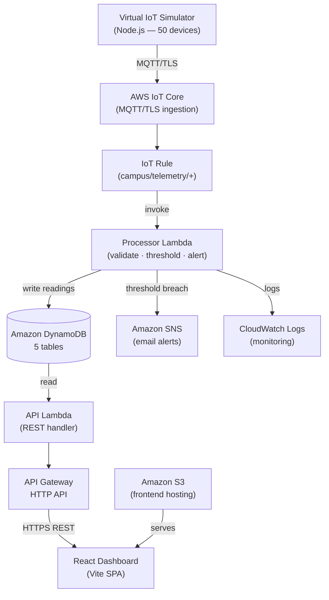

# CampusSense

### VIT Chennai Campus Temperature & Humidity Monitoring System

[](docs/FREE_TIER.md)
[](docs/LIMITATIONS.md)
[](docs/TESTING.md)
[](docs/DEMO_GUIDE.md)

> An AWS cloud mini-project demonstrating a serverless IoT sensor monitoring system using
> 50 simulated virtual devices, AWS IoT Core, Lambda, DynamoDB, and a React dashboard.

---

## Overview

CampusSense monitors temperature and humidity across 50 virtual campus locations — laboratories,
classrooms, server rooms, and workshops — at VIT Chennai.

**Physical sensors are not required.** A local Node.js simulator generates realistic sensor data
and publishes it via MQTT to AWS IoT Core. The architecture uses only serverless AWS services,
keeping it within AWS Free Tier allowances at the project's intended scale.

**AWS deployment is performed manually** through the AWS Console. No AWS CLI or SAM CLI is
required. The repository can run entirely locally using a mock API — no AWS account is needed
for local development or demonstration.

---

## Problem Statement

Campus environments contain diverse spaces — server rooms requiring tight temperature control,
laboratories with sensitive equipment, and classrooms where comfort affects learning. Traditional
manual temperature checks are infrequent and reactive. An automated monitoring system can detect
threshold breaches, trigger alerts, and provide historical data for facilities management.

---

## Features

| Feature | Description |
|---------|-------------|
| 50 virtual campus locations | Labs, classrooms, server rooms, workshops across VIT Chennai |
| Real-time telemetry | Temperature (°C) and humidity (%) per device |
| Per-location thresholds | Each device type has custom alert thresholds |
| Alert state machine | NORMAL → ALERT → sustained ALERT → RECOVERY → future ALERT |
| SNS email notifications | Email on first breach; no spam during sustained alerts |
| Historical readings | 90-day retention with DynamoDB TTL |
| REST API | 7 endpoints serving the React dashboard |
| React dashboard | Dashboard, Locations, Location Detail, Alerts, System Monitor |
| Mock / local mode | Full UI demo without AWS account |
| System monitoring | Processing counters, error tracking, last-seen timestamps |
| AWS Free Tier design | No EC2, RDS, NAT Gateway, or continuously-running compute |

---

## Architecture



Full architecture detail: [docs/ARCHITECTURE.md](docs/ARCHITECTURE.md)
Architecture diagram (Mermaid source): [docs/architecture.mmd](docs/architecture.mmd)
Data flow diagram: [docs/data-flow.mmd](docs/data-flow.mmd)

---

## AWS Service Mapping

| Requirement | AWS Service | Local Equivalent |
|-------------|-------------|------------------|
| Telemetry ingestion | AWS IoT Core (MQTT) | Simulator dry-run (log only) |
| Message routing | IoT Rules Engine | — |
| Data processing | AWS Lambda (Processor) | Unit-tested in-memory |
| Storage | Amazon DynamoDB (5 tables) | In-memory repositories |
| API | API Gateway HTTP API + Lambda | Mock API (`mock-api.ts`) |
| Alerts / notifications | Amazon SNS (email) | `MockNotificationService` |
| Logging | Amazon CloudWatch Logs | `CapturingLogger` / console |
| Frontend hosting | Amazon S3 (static website) | Vite dev server (`localhost:5173`) |
| Infrastructure definition | AWS SAM / CloudFormation | `backend/template.yaml` (blueprint only) |

> **Note:** "Local Equivalent" entries are for development and testing only.
> They are not substitutes for AWS integration testing.

---

## Technology Stack

**Frontend:** React 18 · TypeScript · Vite · Chart.js · Lucide React

**Backend (Lambda):** TypeScript · Node.js 22 · AWS SDK v3 (DynamoDB, SNS)

**Simulator:** TypeScript · Node.js · aws-iot-device-sdk-v2 · dotenv

**AWS Services:** IoT Core · Lambda · DynamoDB · API Gateway (HTTP) · SNS · CloudWatch · S3

**Testing:** Vitest · in-memory test doubles (no AWS required)

**Infrastructure Blueprint:** AWS SAM / CloudFormation (`backend/template.yaml`)

---

## Quick Start — Local Development (No AWS Required)

### 1. Install Dependencies

```powershell
npm run install:all
```

Or install each package separately:

```powershell
npm install --prefix backend
npm install --prefix simulator
npm install --prefix frontend
```

### 2. Start the Dashboard (Mock Mode)

```powershell
# frontend/.env already has VITE_USE_MOCK_API=true
npm run dev
```

Open **http://localhost:5173** — the dashboard loads instantly with mock data.
A **MOCK** badge appears in the sidebar to indicate local mode.

### 3. Run Backend Tests

```powershell
npm test
```

Expected: **28/28 tests pass** in ~3 seconds.

### 4. Run Simulator (Dry-Run Mode)

Without AWS credentials, the simulator runs in DRY_RUN mode — it logs payloads
locally without publishing to MQTT:

```powershell
npm run simulate:once
```

---

## Simulator Usage

The simulator generates telemetry for all 50 virtual devices. It requires AWS IoT
credentials to publish to AWS IoT Core. Without them, it runs in local log-only mode.

```powershell
# Continuous simulation (10-minute default interval)
npm run simulate

# Single round and exit
npm run simulate:once

# Force SRV-01 (server room) into ALERT state
npm run simulate -- --anomaly=SRV-01

# 30-second interval for rapid testing (WARNING: not the default)
npm run simulate -- --interval=30 --duration=5

# Anomaly for 10 minutes then exit
npm run simulate -- --anomaly=LAB-05 --duration=10
```

> **Warning:** Short intervals (e.g., `--interval=30`) are for testing only.
> The default 10-minute interval (`SIMULATOR_INTERVAL_MS=600000`) is designed to
> remain within AWS Free Tier usage allowances.

Simulator documentation: [docs/SIMULATOR.md](docs/SIMULATOR.md)

---

## Alert Demonstration (Local Mock Mode)

The mock API pre-loads one active alert (SRV-01) and one recovered alert (LAB-06)
to demonstrate the full alert lifecycle in the dashboard without AWS:

```
SRV-01 Main Server Room
  → NORMAL   (temperature below 22°C threshold)
  → ALERT    (temperature exceeded 22°C — SNS email would be sent)
  → sustained ALERT  (temperature still high — no duplicate notification)
  → RECOVERY (temperature returned below threshold)
  → ALERT    (next breach — new notification)
```

To demonstrate the alert state machine with the local backend unit tests:

```powershell
npm test --prefix backend
# Look for the "executes full 6-reading lifecycle" test
```

---

## Testing

```powershell
# Backend unit tests (28 tests, ~3 seconds, no AWS required)
npm test

# TypeScript type checking (all packages)
npm run typecheck

# Frontend build verification
npm run build:frontend
```

**Current test status:**
- ✅ 28/28 backend unit tests pass
- ✅ Backend TypeScript: clean
- ✅ Simulator TypeScript: clean
- ✅ Frontend TypeScript: clean
- ✅ Frontend Vite build: passes
- ❌ AWS live integration: not yet tested (requires manual AWS deployment)

Full testing documentation: [docs/TESTING.md](docs/TESTING.md)

---

## Free-Tier-Conscious Architecture

CampusSense deliberately avoids services that generate continuous costs:

| Avoided | Reason |
|---------|--------|
| EC2 / RDS | Hourly charges even when idle |
| Fargate / EKS | Container orchestration overhead |
| NAT Gateway | Fixed hourly data-transfer charge |
| Kinesis / MSK | Stream processing at this scale is unnecessary |
| Cognito | Authentication adds complexity outside MVP scope |
| CloudFront | Not required for a college demo frontend |

The architecture uses a **100% event-driven, pay-per-use** model. At 50 devices
with a 10-minute telemetry interval, the project generates approximately 216,000
MQTT messages per month.

> The architecture is designed to operate within applicable AWS Free Tier allowances
> at the intended project scale, subject to the AWS account's current eligibility,
> pricing terms, service limits, and actual usage. Verify current Free Tier terms
> before deploying.

Full cost analysis: [docs/FREE_TIER.md](docs/FREE_TIER.md)

---

## Repository Structure

```
campus-temp-monitor/
├── README.md
├── CHANGELOG.md
├── package.json                 # Root scripts for running all packages
│
├── backend/
│   ├── src/
│   │   ├── handlers/            processor.ts, api.ts (Lambda handlers)
│   │   ├── services/            TelemetryService, AlertService, StatisticsService
│   │   ├── repositories/        Interfaces + InMemory + DynamoDB implementations
│   │   ├── adapters/            DynamoDB, SNS, CloudWatch, logging adapters
│   │   ├── validators/          Telemetry payload schema validation
│   │   ├── models/              TypeScript data types
│   │   └── config/              Environment variable loading
│   ├── tests/                   28 unit tests (Vitest, no AWS required)
│   └── template.yaml            AWS infrastructure blueprint (CloudFormation/SAM)
│
├── simulator/
│   ├── src/
│   │   ├── index.ts             CLI entry point
│   │   ├── simulator.ts         Simulation engine (rounds, intervals)
│   │   ├── sensor-generator.ts  Realistic value generation per device type
│   │   ├── anomaly-manager.ts   Fault injection (--anomaly flag)
│   │   ├── device-manager.ts    Device state tracking
│   │   ├── mqtt-client.ts       Real AWS IoT + MockMqttClient (dry-run)
│   │   └── config.ts, logger.ts, types.ts
│   ├── devices.json             50 virtual device definitions
│   └── .env.example             Simulator configuration template
│
├── frontend/
│   ├── index.html
│   └── src/
│       ├── pages/               Dashboard, Locations, LocationDetail, Alerts, SystemMonitor
│       ├── components/          SensorCard, KpiCard, StatusBadge, Charts
│       ├── services/            api.ts (real + mock routing), mock-api.ts
│       └── types/               TypeScript interface definitions
│
└── docs/
    ├── ARCHITECTURE.md          System architecture & service responsibilities
    ├── architecture.mmd         Mermaid architecture diagram source
    ├── data-flow.mmd            Mermaid data flow diagram source
    ├── API.md                   REST API endpoint specification
    ├── DATA_MODEL.md            DynamoDB table schemas
    ├── SIMULATOR.md             Simulator behaviour and modes
    ├── DEPLOYMENT.md            Manual AWS Console deployment guide
    ├── AWS_CONSOLE_CHECKLIST.md Step-by-step AWS setup checklist
    ├── AWS_MANUAL_DEPLOYMENT_GAPS.md  Prerequisites & environment variable reference
    ├── AWS_CONNECTION_GUIDE.md  How to connect local code to AWS
    ├── FREE_TIER.md             Cost-optimisation rationale
    ├── TESTING.md               Testing strategy & results
    ├── DECISIONS.md             Architectural decision records
    ├── LIMITATIONS.md           Known limitations & scope boundaries
    ├── DEMO_GUIDE.md            5–10 minute college presentation guide
    ├── PROJECT_STATUS.md        Current implementation status
    ├── PROJECT_SPEC.md          Original project requirements
    └── PHASE_4_FINAL_REVIEW.md  Final pre-GitHub review
```

---

## AWS Manual Deployment

AWS deployment for this project is **manual via the AWS Console**.
No AWS CLI or SAM CLI is required.

1. Read the deployment overview: [docs/DEPLOYMENT.md](docs/DEPLOYMENT.md)
2. Follow the step-by-step checklist: [docs/AWS_CONSOLE_CHECKLIST.md](docs/AWS_CONSOLE_CHECKLIST.md)
3. Understand prerequisites: [docs/AWS_MANUAL_DEPLOYMENT_GAPS.md](docs/AWS_MANUAL_DEPLOYMENT_GAPS.md)
4. See the connection guide: [docs/AWS_CONNECTION_GUIDE.md](docs/AWS_CONNECTION_GUIDE.md)
5. Review the infrastructure blueprint: [backend/template.yaml](backend/template.yaml)

**Do not commit** certificate files, `.env` files with real values, or AWS credentials to Git.

---

## Known Limitations

1. **No physical sensors** — all 50 devices are virtual, simulated locally
2. **AWS live deployment not performed** — this repository represents the local development phase; integration testing requires manual AWS deployment
3. **No authentication** — the dashboard API has no auth layer (outside MVP scope for this college project)
4. **No deep message deduplication** — `messageId` is stored but not used to prevent re-insertion of duplicate messages
5. **Mock mode is local only** — `VITE_USE_MOCK_API=true` provides a local demo; it is not a substitute for AWS integration testing
6. **Free Tier suitability** — depends on the AWS account's current eligibility, pricing terms, and actual usage

Full limitations: [docs/LIMITATIONS.md](docs/LIMITATIONS.md)

---

## Future Extension to Physical Sensors

The architecture is designed to support physical sensors with minimal changes:

1. Provision a real AWS IoT certificate per physical device
2. Flash the certificate and endpoint to each sensor's firmware
3. The sensor publishes to `campus/telemetry/<deviceId>` — the same topic the simulator uses
4. The backend Lambda, DynamoDB schema, API, and dashboard require **no changes**
5. Remove or run the simulator alongside real devices for a hybrid setup

---

## Documentation Index

| Document | Description |
|----------|-------------|
| [ARCHITECTURE.md](docs/ARCHITECTURE.md) | System design, data flow, service responsibilities |
| [API.md](docs/API.md) | REST API endpoint specification |
| [DATA_MODEL.md](docs/DATA_MODEL.md) | DynamoDB table schemas |
| [SIMULATOR.md](docs/SIMULATOR.md) | Simulator behaviour and CLI flags |
| [DEPLOYMENT.md](docs/DEPLOYMENT.md) | Manual AWS Console deployment guide |
| [AWS_CONSOLE_CHECKLIST.md](docs/AWS_CONSOLE_CHECKLIST.md) | Step-by-step AWS setup checklist |
| [AWS_CONNECTION_GUIDE.md](docs/AWS_CONNECTION_GUIDE.md) | Connecting local code to AWS |
| [FREE_TIER.md](docs/FREE_TIER.md) | Cost-optimisation rationale |
| [TESTING.md](docs/TESTING.md) | Testing strategy and results |
| [DECISIONS.md](docs/DECISIONS.md) | Architectural decision records |
| [LIMITATIONS.md](docs/LIMITATIONS.md) | Known limitations and scope boundaries |
| [DEMO_GUIDE.md](docs/DEMO_GUIDE.md) | 5–10 minute college presentation guide |
| [PROJECT_STATUS.md](docs/PROJECT_STATUS.md) | Current implementation status |
| [CHANGELOG.md](CHANGELOG.md) | Project milestone history |
