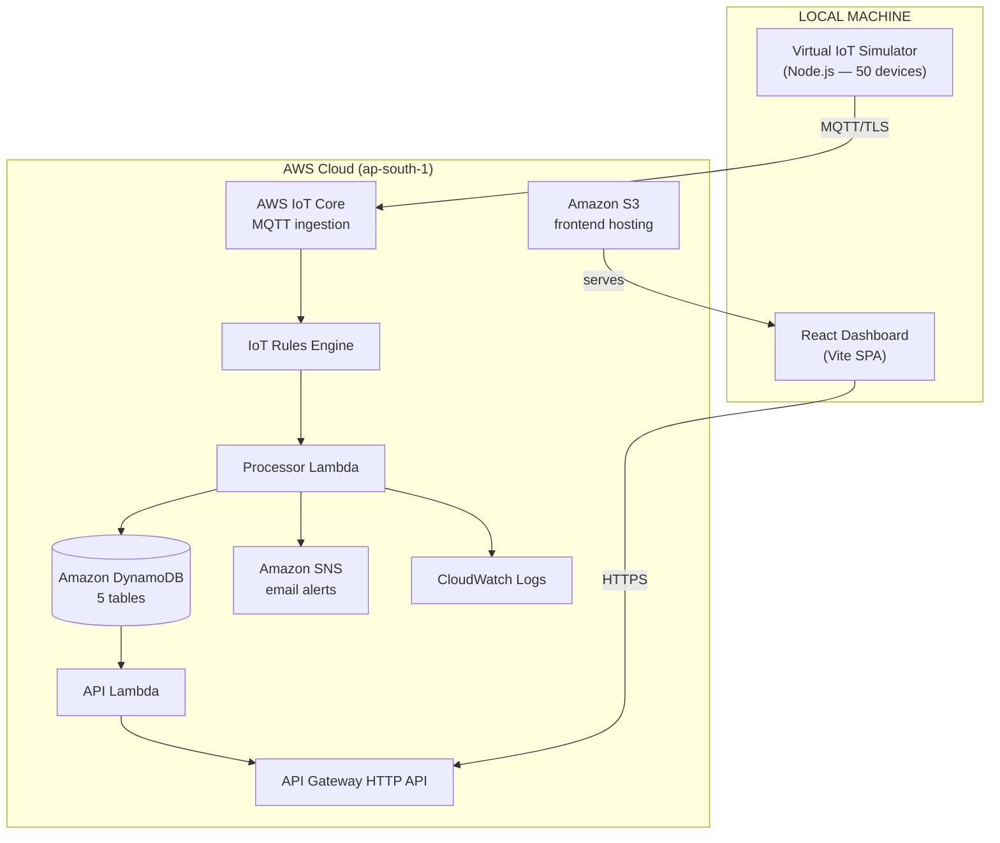

# CampusSense — Architecture

> **Deployment status:** The architecture described here represents the **planned AWS deployment**.
> AWS live integration has not yet been performed. The local simulator and mock API
> operate independently of AWS. Clearly marked LOCAL vs AWS below.

---

## System Overview

CampusSense is a serverless IoT monitoring platform. 50 virtual campus sensor devices
report temperature and humidity telemetry via MQTT. The data flows through AWS IoT Core
into a Lambda-based processing pipeline, persisted in DynamoDB, and served to a React
dashboard via API Gateway.

The system is divided into two clear boundaries:

- **LOCAL** — runs on a developer machine without AWS credentials
- **AWS** — the planned cloud deployment (manual console setup required)

---

## Mermaid Architecture Diagram

See [architecture.mmd](./architecture.mmd) for the complete diagram source.



Data flow detail: [data-flow.mmd](./data-flow.mmd)

---

## LOCAL Architecture

When running locally (no AWS credentials):

| Component | Local implementation |
|-----------|---------------------|
| IoT Simulator | Runs in DRY_RUN mode — logs payloads, no MQTT publish |
| Backend logic | Unit-tested with in-memory repositories (no DynamoDB) |
| Frontend | Reads from `mock-api.ts` (`VITE_USE_MOCK_API=true`) |
| Notifications | `MockNotificationService` captures alerts in memory |
| Dashboard | Vite dev server at `http://localhost:5173` |

The local mock setup exists so the entire application can be developed,
demonstrated, and tested without an AWS account.

---

## AWS Architecture

### Component Responsibilities

#### AWS IoT Core
- Receives MQTT connections from the simulator over TLS (port 8883)
- Authenticates the simulator using X.509 certificates
- Routes messages matching `campus/telemetry/+` to the IoT Rule

#### IoT Rules Engine
- SQL: `SELECT *, topic(3) AS deviceId FROM 'campus/telemetry/+'`
- Extracts `deviceId` from the topic path (3rd segment)
- Invokes `CampusSenseProcessor` Lambda synchronously for each message

#### Processor Lambda (`CampusSenseProcessor`)
- Validates the telemetry payload schema
- Checks device existence in `CampusDevices`
- Determines status (NORMAL / ALERT) by comparing to device thresholds
- Writes historical reading to `CampusReadings`
- Upserts latest snapshot to `CampusCurrent`
- Runs the alert state machine (NORMAL → ALERT → RECOVERY transitions)
- Publishes SNS notification on first threshold breach (not on sustained alerts)
- Updates processing counters in `CampusSystemStats`
- Logs structured JSON to CloudWatch

#### API Lambda (`CampusSenseApi`)
- Handles all REST API routes from API Gateway
- Reads from DynamoDB (`CampusCurrent`, `CampusReadings`, `CampusAlerts`, `CampusDevices`, `CampusSystemStats`)
- Strips internal DynamoDB keys (`campusId`, `sk`) from responses
- Returns JSON responses to the dashboard

#### Amazon DynamoDB (5 tables)

| Table | PK | SK | Purpose |
|-------|----|----|---------|
| `CampusDevices` | `deviceId` | — | Static device/location config |
| `CampusReadings` | `deviceId` | `timestamp` | Historical time-series (TTL 90 days) |
| `CampusCurrent` | `deviceId` | — | Latest reading per device (overwritten each cycle) |
| `CampusAlerts` | `campusId` | `sk` (timestamp#alertId) | Alert event history |
| `CampusSystemStats` | `metricId` | — | Processing counters (GLOBAL) |

All tables use **On-Demand (Pay Per Request)** billing. `CampusReadings` has a
90-day TTL (`expiresAt` attribute) to automatically remove old data.

#### Amazon SNS (`CampusSenseAlerts`)
- Standard topic with email subscription
- Receives `Publish` calls from the Processor Lambda only on NORMAL → ALERT transitions
- Does not receive calls on sustained alerts (deduplication in `AlertService`)
- Subscriber must confirm the email subscription manually

#### Amazon CloudWatch Logs
- Receives structured JSON logs from both Lambda functions
- Log groups: `/aws/lambda/CampusSenseProcessor`, `/aws/lambda/CampusSenseApi`
- 30-day retention (configured in `template.yaml`)

#### API Gateway (HTTP API)
- HTTP API type (cheaper than REST API, lower latency)
- Lambda proxy integration → `CampusSenseApi`
- CORS configured to allow the S3-hosted frontend origin
- Routes: `GET /api/v1/health`, `/devices`, `/readings/latest`, `/readings/history`, `/alerts`, `/system`; `POST /api/v1/telemetry`

#### Amazon S3
- Static website hosting for the `frontend/dist/` build output
- `index.html` as both index and error document (SPA routing)
- Public read access policy

---

## Data Flow

### Telemetry Ingestion Path

```
Virtual Sensor (sensor-generator.ts)
    ↓ generatePayload()
MQTT Publish (campus/telemetry/<deviceId>)
    ↓ TLS / port 8883
AWS IoT Core
    ↓ certificate authentication
IoT Rules Engine (campus/telemetry/+)
    ↓ invoke
Processor Lambda
    ├── Schema validation (telemetry-validator.ts)
    ├── Device existence check (CampusDevices)
    ├── Threshold comparison → DeviceStatus
    ├── Save to CampusReadings (history)
    ├── Upsert CampusCurrent (snapshot)
    ├── Alert state machine → CampusAlerts / SNS
    └── Update CampusSystemStats counters
```

### API Read Path

```
React Dashboard (browser)
    ↓ HTTPS GET
API Gateway HTTP API
    ↓ Lambda proxy
API Lambda (handlers/api.ts)
    ↓ DynamoDB Query / GetItem / Scan
Amazon DynamoDB
    ↓ JSON items
API Lambda → strip DB internals → JSON response
    ↓
React Dashboard
```

---

## AWS Service Mapping Table

| Project Requirement | AWS Service | Notes |
|--------------------|-------------|-------|
| Telemetry ingestion | AWS IoT Core | MQTT/TLS, X.509 auth |
| Message routing | IoT Rules Engine | SQL topic filter |
| Data processing | AWS Lambda (Processor) | Event-driven, no idle cost |
| Historical storage | DynamoDB (CampusReadings) | 90-day TTL |
| Current state storage | DynamoDB (CampusCurrent) | Overwritten each cycle |
| Alert history | DynamoDB (CampusAlerts) | Append-only event log |
| System metrics | DynamoDB (CampusSystemStats) | Atomic counter updates |
| Device registry | DynamoDB (CampusDevices) | Seeded from `devices.json` |
| REST API | API Gateway HTTP API + Lambda | Serverless, pay-per-request |
| Notifications | Amazon SNS | Email; de-duplicated |
| Monitoring & logging | CloudWatch Logs | 30-day retention |
| Frontend hosting | Amazon S3 | Static website hosting |
| Infrastructure IaC | AWS SAM / CloudFormation | Blueprint in `template.yaml` |

---

## Infrastructure Blueprint

`backend/template.yaml` describes the full infrastructure as AWS SAM /
CloudFormation. It is used as a **reference and future automation target**.
The current deployment process is manual via the AWS Console.

See the template for exact IAM permissions, environment variable wiring,
and resource configuration.
